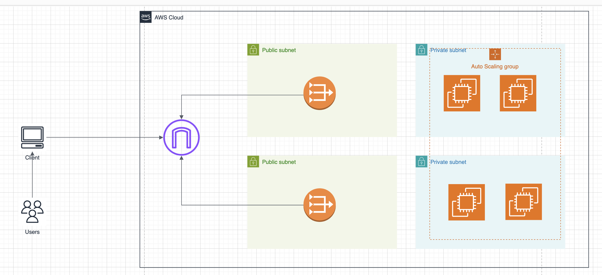

# Udagram Infrastructure as Code Project

## Overview
This project sets up the Udagram application infrastructure using AWS CloudFormation, focusing on network configuration and server deployment to create a scalable, highly available web app.



## Architecture
The infrastructure is defined through various CloudFormation scripts:
- **Network Stack**: Configures the VPC, subnets, NAT gateways, and route tables.
- **Server Stack**: Deploys EC2 instances within Auto Scaling groups with load balancing.

## Directory Structure
- `templates/`: CloudFormation YAML templates.
- `parameters/`: JSON files for template parameters.
- `*.sh/`: Shell scripts for automation.
- `screenshots/`: Documentation of the setup process.

## Prerequisites
To run this project, ensure you have:
- AWS CLI installed and configured (use the `--profile udacity` flag if you're not using the default).
- An S3 bucket for storing CloudFormation templates (optional but recommended).
- SSH key pairs for EC2 access.

## Setup Instructions

### 1. Create the Network Infrastructure
Run the network setup script:
```bash
bash command/0-create-network.sh 
```

### 2. Deploy the Resources
After the network stack is complete, deploy the servers:
```bash
bash command/1-create-infrastructure.sh 
```

### 4. Verify Deployment
Check the AWS CloudFormation console to ensure that stacks are created without errors. You should see outputs such as URLs or instance IDs in the console.

## Cleanup
To delete the stacks and avoid ongoing charges:
```bash
aws cloudformation delete-stack --stack-name udagram-network --region us-east-1 --profile udacity
aws cloudformation delete-stack --stack-name udagram-infrastructure --region us-east-1 --profile udacity
```


## Notes
- Adjust the parameters in `parameters/network-parameters.json` and `parameters/udagram-parameters.json` as necessary.
- Ensure the scripts are executable and AWS CLI commands are correctly formatted.

URL: http://udagra-webap-ytl8tgd7ef3o-787399571.us-east-1.elb.amazonaws.com/
